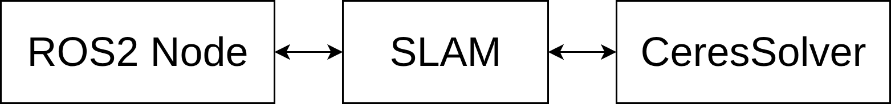
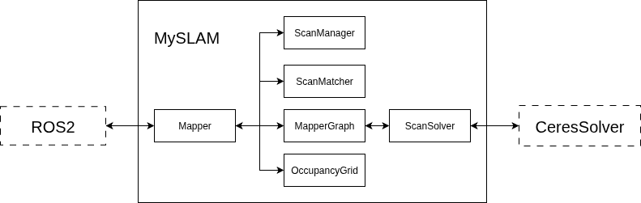

# LiDAR-based SLAM
This repository provides a minimal LiDAR-based SLAM implementation, leveraging SLAM Toolbox and Karto SLAM.
It currently supports processing scan data from a single LiDAR sensor.

## Project Structure
The project is organized into the following components:

- ROS 2 Wrapper – Integrates the SLAM library into the ROS 2 ecosystem.
- Standalone SLAM Library – Implements the core SLAM logic.
- Ceres Solver – Serves as the back-end optimization engine.

## SLAM
The SLAM library is organized as follows:

Core classes:
- `Mapper` - Main interface for receiving input data and producing SLAM outputs.
- `ScanManager` - Manages incoming laser scan data.
- `ScanMatcher` - Performs scan matching, essential for odometry correction and loop closure validation.
- `MapperGraph` – Handles graph construction and loop detection.
- `OccupancyGrid` – Generates an occupancy grid map from recorded scans and robot poses.
- `ScanSolver` – Abstract interface enabling integration with various optimization back-ends.
